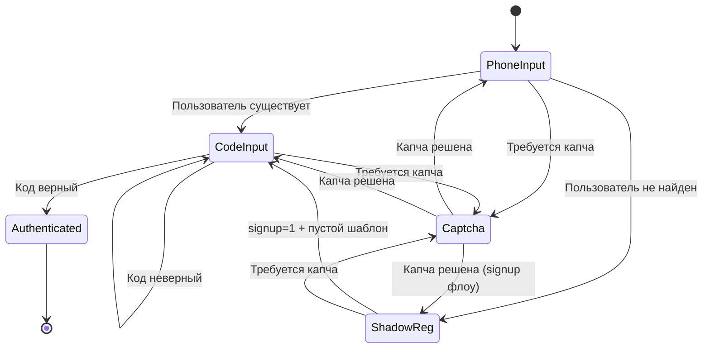

# Auth Flow — Сценарии авторизации и регистрации

Описание полного кейса авторизации и регистрации пользователей в приложении WFM для получения JWT токенов, необходимых для дальнейшего доступа к API приложения.

**Важно:** Авторизация осуществляется **внешним сервером** Beyond Violet (OAuth2 провайдер). WFM не генерирует токены, не проверяет коды и не доставляет их пользователю. WFM только вызывает внешний API и получает готовые токены (`access_token` и `refresh_token`).

**API спецификация:** `.memory_bank/backend/external/api_bv.md`

**Связанные документы:**
- `.memory_bank/domain/auth/auth_validation.md` — правила валидации
- `.memory_bank/mobile/feature_auth/feature_auth_screens.md` — UX и UI экранов
- `.memory_bank/backend/external/api_bv.md` — API спецификация
- `.memory_bank/patterns/security_hcaptcha.md` — защита от ботов

---

## 1. Общая логика

Авторизация состоит из двух шагов:

```
1. Ввод номера телефона
     ↓ (для нового пользователя — теневая регистрация, прозрачно для UI)
2. Ввод кода подтверждения
     ↓
3. Вход в приложение
```

**Капча** может потребоваться на любом этапе при подозрительной активности.

---

## 2. Диаграмма состояний



---

## 3. Состояния

### PhoneInput (Ввод номера)
**Цель:** Определить, существует ли пользователь и выбрать способ получения кода.

**Действия пользователя:**
- Выбор способа доставки через таб бар: "Telegram" или "Телефон"
- Ввод номера телефона

**Переходы:**
- Пользователь существует → **CodeInput** (код отправлен выбранным способом)
- Пользователь не найден → **Registration**
- Требуется капча → **Captcha**

---

### ShadowReg (Теневая регистрация)
**Цель:** Автоматически зарегистрировать нового пользователя без показа UI.

**Логика:**
- При `AUTH_USER_NOT_EXISTS` — немедленно отправить `POST /oauth/authorize/` с `signup=1`
- Данные пользователя — пустой шаблон: `first_name=""`, `last_name=""`, `gender=1`, `birth_date="1970-01-01"`, `city_id=1`
- Пользователь видит только загрузку, затем переходит на CodeInput

**Переходы:**
- Код отправлен → **CodeInput**
- Требуется капча → **Captcha**

---

### CodeInput (Ввод кода)
**Цель:** Подтвердить номер телефона.

**Переходы:**
- Код верный → **Authenticated** (сохранить токены, войти в приложение)
- Код неверный → **CodeInput** (повторить ввод)
- Требуется капча → **Captcha**

---

### Captcha (Защита от ботов)
**Цель:** Проверка через hCaptcha.

**Переходы:**
После решения капчи повторяется предыдущий запрос с токеном капчи.

Подробнее: `.memory_bank/patterns/security_hcaptcha.md`

---

### Authenticated (Авторизован)
**Результат:** Токены сохранены, пользователь вошел в приложение.

Подробнее: `.memory_bank/mobile/token_storage.md`, `.memory_bank/mobile/navigation.md`

---

## 4. Сценарии

### Существующий пользователь

```
Ввод номера → Отправка кода → Ввод кода → Вход
```

### Новый пользователь

```
Ввод номера → Теневая регистрация (авто) → Ввод кода → Вход
```

### С капчей

```
Любой запрос → Требуется капча → Решение капчи → Повтор запроса → Продолжение flow
```

---

## 5. Канал доставки кода

Сервер выбирает канал доставки: `telegram`, `sms` или `call`.
При повторной отправке канал может измениться.

Подробнее: `.memory_bank/domain/auth/auth_validation.md` (раздел 4)

---

## 6. Обработка ошибок

Коды ошибок и их обработка: `.memory_bank/backend/external/api_bv.md` (раздел 9)

**Основные:**
- `AUTH_USER_NOT_EXISTS` → теневая регистрация (авто, без UI)
- `AUTH_CAPTCHA_REQUIRED` → показать капчу
- `7` → неверный код
- Сетевые ошибки → "Проверьте подключение к интернету"

---

## 7. Итог

**Ключевые моменты:**
- Простая последовательность: номер → регистрация (опционально) → код → вход
- Капча может появиться на любом этапе
- Сервер выбирает канал доставки кода
- Все детали валидации в `.memory_bank/domain/auth/auth_validation.md`
- Все детали UX в `.memory_bank/mobile/feature_auth/feature_auth_screens.md`
