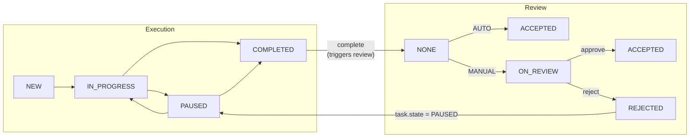

# Task States

## 1. Execution State (TaskState)

Описывает стадию **исполнения** задачи работником. Независима от review_state.

### Состояния

| Состояние | Описание |
|-----------|----------|
| NEW | Задача создана, исполнение не начато |
| IN_PROGRESS | Работник выполняет задачу |
| PAUSED | Работник приостановил выполнение |
| COMPLETED | Работник завершил выполнение |

### Разрешённые переходы

| Из | В | Endpoint | Кто |
|----|---|----------|-----|
| NEW | IN_PROGRESS | `POST /{id}/start` | WORKER |
| IN_PROGRESS | PAUSED | `POST /{id}/pause` | WORKER |
| PAUSED | IN_PROGRESS | `POST /{id}/resume` | WORKER |
| IN_PROGRESS | COMPLETED | `POST /{id}/complete` | WORKER |
| PAUSED | COMPLETED | `POST /{id}/complete` | WORKER |
| COMPLETED | PAUSED | `POST /{id}/reject` | MANAGER (через review flow) |

### Недопустимые переходы

- Нельзя завершить задачу, не начав её
- Нельзя возобновить задачу, которая не была приостановлена
- Из COMPLETED нет прямых переходов — только через reject в review flow

---

## 2. Review State (TaskReviewState)

Отдельное измерение задачи, описывающее стадию **приёмки** менеджером. Активируется после перехода в COMPLETED, не зависит от execution state.

### Состояния

| Состояние | Описание |
|-----------|----------|
| NONE | Приёмка не актуальна (задача ещё не COMPLETED) |
| ON_REVIEW | Задача ожидает проверки менеджером |
| ACCEPTED | Задача принята (менеджером вручную или системой автоматически) |
| REJECTED | Задача отклонена; execution state возвращается в PAUSED |

### Разрешённые переходы

| Из | В | Условие | Кто |
|----|---|---------|-----|
| NONE | ACCEPTED | acceptance_policy = AUTO при COMPLETE | system |
| NONE | ON_REVIEW | acceptance_policy = MANUAL при COMPLETE | system |
| ON_REVIEW | ACCEPTED | `POST /{id}/approve` | MANAGER |
| ON_REVIEW | REJECTED | `POST /{id}/reject` (с обязательным reason) | MANAGER |

> При переходе в REJECTED: execution state задачи также возвращается в PAUSED.
> Работник исправляет выполнение и снова вызывает complete — review цикл повторяется.

---

## 3. Acceptance Policy (AcceptancePolicy)

Политика задачи, определяющая поведение review_state в момент завершения (complete).

| Значение | Поведение при COMPLETE |
|----------|------------------------|
| AUTO | review_state → ACCEPTED автоматически; событие AUTO_ACCEPT (actor_role=system) |
| MANUAL | review_state → ON_REVIEW; событие SEND_TO_REVIEW; ждём действия менеджера |

**По умолчанию:** AUTO (обратная совместимость — не меняет текущее поведение).

**Будущее расширение:** RULES — автоматическая маршрутизация на основе триггеров (новый сотрудник, превышение времени, нет фото и т.п.) — не входит в текущую реализацию.

---

## 4. Диаграммы

### 4.1 Execution State Machine

```mermaid
flowchart TD
    A([Start]) --> B[NEW]

    B -- start --> C[IN_PROGRESS]

    C -- pause --> D[PAUSED]
    D -- resume --> C

    C -- complete --> E[COMPLETED]
    D -- complete --> E

    E -. reject\n╰ task.state = PAUSED .-> D
```

### 4.2 Review State Machine

```mermaid
flowchart TD
    N[NONE] -->|complete\nacceptance_policy=AUTO| ACC_AUTO[ACCEPTED\nactor_role=system]
    N -->|complete\nacceptance_policy=MANUAL| OR[ON_REVIEW]

    OR -->|approve\nMANAGER| ACC_MAN[ACCEPTED]
    OR -->|reject\nMANAGER\nreason обязателен| REJ[REJECTED]

    REJ -. task.state → PAUSED\nцикл повторяется .-> N2[NONE]
```

### 4.3 Полная схема (execution + review)



---

## 5. LAMA интеграция и review_state

При синхронизации из LAMA статусы `Accepted` и `Returned` влияют на оба измерения:

| LAMA статус | execution state | review_state | actor_role | event |
|-------------|-----------------|--------------|------------|-------|
| Created | NEW | без изменений | — | — |
| InProgress | IN_PROGRESS | без изменений | — | — |
| Suspended | PAUSED | без изменений | — | — |
| Completed | COMPLETED | без изменений | — | — |
| **Accepted** | COMPLETED | **ACCEPTED** | system | ACCEPT |
| **Returned** | PAUSED | **REJECTED** | system | REJECT |

При исходящей синхронизации (WFM → LAMA) review-действия менеджера также отправляются в LAMA:

| WFM действие | LAMA статус |
|--------------|-------------|
| approve | Accepted |
| reject | Returned |

---

## 6. Audit Log (task_events)

Каждый переход (как execution, так и review) фиксируется в таблице `task_events`.

**Типы событий:**

| event_type | Триггер | actor_role |
|------------|---------|------------|
| START | NEW → IN_PROGRESS | worker |
| PAUSE | IN_PROGRESS → PAUSED | worker |
| RESUME | PAUSED → IN_PROGRESS | worker |
| COMPLETE | IN_PROGRESS → COMPLETED или PAUSED → COMPLETED | worker |
| SEND_TO_REVIEW | review: NONE → ON_REVIEW | worker* |
| AUTO_ACCEPT | review: NONE → ACCEPTED | system |
| ACCEPT | review: ON_REVIEW → ACCEPTED | manager / system (LAMA) |
| REJECT | review: ON_REVIEW → REJECTED | manager / system (LAMA) |

*SEND_TO_REVIEW записывается сразу после COMPLETE при MANUAL acceptance_policy.

**Правило REJECT:** событие REJECT **всегда** содержит `comment`:
- При ручном reject менеджером — `comment` обязателен (валидация на уровне API)
- При системном REJECT от LAMA — `comment` заполняется если LAMA передаёт причину, иначе null
